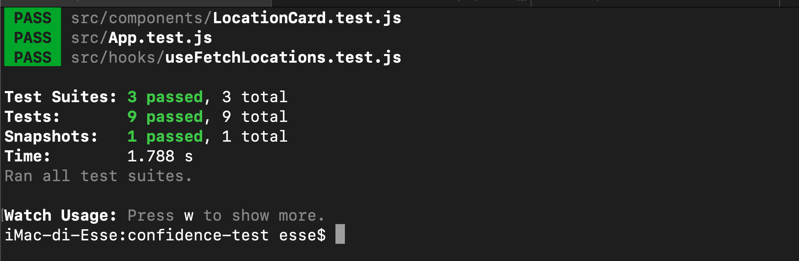

# Confidence - Locations React Project

[App Running video](https://youtu.be/mLxX_XEiOKU)\
[App Unit Test pass video](https://youtu.be/Oo4zkzuHh6I)

## How to install

Clone the repository and run `npm install` or `yarn`

### `npm start`

Runs the app in the development mode.\
Open [http://localhost:3000](http://localhost:3000) to view it in your browser.

### `npm test`

Launches the test runner in the interactive watch mode.\
